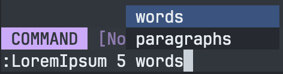

# lorem

lorem is a Go utility library for generating Lorem Ipsum text.

## Todo List

- [X] - Build library code
  - [X] - Customize how many words per sentence
  - [X] - Customize how many sentences per paragraph
  - [X] - Customize the chance of a comma being added to a sentence
- [X] - Build simple CLI
- [ ] - Build Neovim Plugin
  - [ ] - Bootstrap binary for Neovim Plugin
  - [X] - Create ':LoremIpsum' command w/ args
  - [X] - Tab completion between words and paragraphs
  - [ ] - Integrate with completion engine
- [ ] - Write out unit tests for library
  - [X] - Write out tests for Generator
  - [X] - Write out tests for CLI
  - [ ] - Write out tests for Neovim Plugin

## Installation

To install the library, run the following command:

```
go get -u github.com/derektata/lorem
```

If you would like the CLI, grab the latest release from the [Latest Releases][Latest Release].

## Usage as a library

```go
package main

import (
    lorem "github.com/derektata/lorem/ipsum"
)

func main() {
    // Create a new generator
    g := lorem.NewGenerator()
    g.WordsPerSentence = 10 // Customize how many words per sentence
    g.SentencesPerParagraph = 5 // Customize how many sentences per paragraph
    g.CommaAddChance = 3 // Customize the chance of a comma being added to a sentence

    // Generate words
    words := g.Generate(100)
    fmt.Println(words)

    // Generate paragraphs
    paragraphs := g.GenerateParagraphs(3)
    fmt.Println(paragraphs)
}
```

## Usage as a CLI

```bash
Usage of lorem:
  -p, --paragraphs int   number of paragraphs to generate
  -w, --words int        number of words to generate (default 100)

Examples:
  $ lorem -p 5
  $ lorem -w 500
```

## Usage as a Neovim Plugin

Make sure you have the binary from the [Latest Releases][Latest Release] in your PATH, then:

Installing the plugin via Lazy:
```lua
{ 
  "derektata/lorem",
  config = function()
    require("lorem")
  end
},
```

Usage in Editor:
```
:LoremIpsum 5 <tab>
```



## License

MIT License

[Latest Release]: https://github.com/derektata/lorem/releases